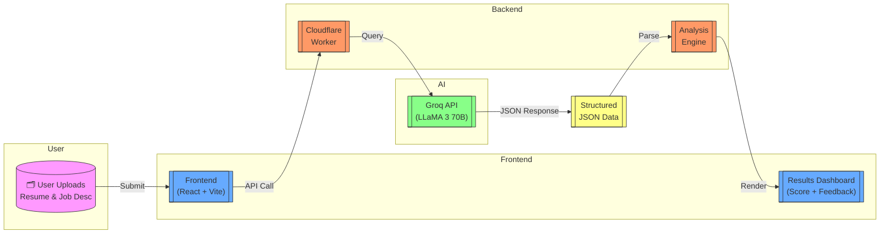

# Resume Analyzer AI


> **Resume Analyzer AI** uses the blazing-fast **LLaMA3-70B model via Groq API** to evaluate how well a resume aligns with a job description — showing strengths, weaknesses, and a smart match score. Serverless and modern, it's built with **Cloudflare Workers** and **React + Vite**.

---

## 🚀 Key Features

| Feature               | Description                                                       |
|-----------------------|-------------------------------------------------------------------|
| 🧠 LLM-Powered         | Uses Groq's LLaMA3-70B for intelligent, JSON-structured analysis |
| 📊 Structured Output   | Returns strengths, weaknesses, score, and recommendations         |
| ⚡ Serverless Infra     | Backend deployed on Cloudflare Workers for ultra-low latency     |
| 🎨 Beautiful Frontend   | UI built with React, Tailwind CSS, and Lucide icons              |
| 🌱 Open Source Ready   | Easily extendable with clear structure and MIT license           |

---

## ⚙️ Architecture Workflow



---

## 🗂 Project Structure

```text
resume-analyzer/
├── frontend/
│   ├── src/components/         # UI components like Hero, Inputs, Results
│   ├── src/services/api.ts     # API handler for /analyze call
│   ├── main.tsx, index.css     # App entry and global styles
│   └── .env                    # VITE_API_BASE_URL config
│
├── backend/
│   ├── src/index.ts            # Cloudflare Worker handler
│   ├── wrangler.toml           # Worker configuration
│   └── .dev.vars               # Local dev API key env vars
│
├── LICENSE
├── SECURITY.md
├── CODE_OF_CONDUCT.md
└── README.md
```

---

## 📦 Setup & Run Locally

### ✅ Clone & Navigate

```bash
git clone https://github.com/vxrachit/resume-analyzer.git
cd resume-analyzer
```

### 🎨 Frontend Setup

```bash
cd frontend
npm install
npm run dev
```

Visit: [http://localhost:5173](http://localhost:5173)

### 🟧 Backend (Cloudflare Workers)

```bash
cd ../backend
npx wrangler dev
```

> Make sure `.dev.vars` contains your `GROQ_API_KEY`

---

## 🔐 Add Secrets for Deployment

```bash
npx wrangler secret put GROQ_API_KEY
```

To deploy the worker:

```bash
npx wrangler publish
```

---

## 📡 API Reference

### POST `/analyze`

Send resume and job description as plain text.

#### Request:

```json
{
  "resume_text": "Experienced React developer...",
  "job_description": "Frontend Engineer with React, Vite..."
}
```

#### Response:

```json
{
  "strengths": ["Strong React experience", "Vite familiarity"],
  "weaknesses": ["No backend exposure"],
  "match_score": 78,
  "conclusion": "Strong fit for UI roles, backend knowledge can be improved."
}
```

---

## 🌐 Deployment Recommendations

| Part      | Platform       | Command/Note                      |
|-----------|----------------|----------------------------------|
| Frontend  | Cloudflare / Vercel / Netlify | Deploy via GitHub                |
| Backend   | Cloudflare     | `wrangler publish`                |

---

## 🔐 License

MIT License — free to use, modify, and share.

---

## 🌱 Future Roadmap

- PDF/Docx Resume upload and parsing  
- Admin dashboard for HR teams  
- Multilingual analysis support  
- Gemini Vision resume parser  

---

## 🔗 GitHub

View Source: [https://github.com/vxrachit/resume-analyzer](https://github.com/vxrachit/resume-analyzer)
