# 📘 Semantic Search & QA over Policy Documents


:icon-mark-github: **GitHub** · [vxrachit/Semantic-Search-QA-over-Policy-Documents](https://github.com/vxrachit/Semantic-Search-QA-over-Policy-Documents){target="_blank"}

> A **FastAPI backend** that enables PDF ingestion, vector search using **FAISS**, and precise Q&A over policy documents with **Google Gemini**, including **citations and per-user isolation**.

---

## :icon-rocket: Feature Highlights

| Feature | Role |
|---------|------|
| 📄 **PDF Ingestion** | Upload one or more policy PDFs, tied to a specific `user_id` |
| 🧮 **Embeddings** | Convert document text into dense vectors with `sentence-transformers` |
| 🔍 **Semantic Search** | Retrieve top-k context snippets using FAISS similarity search |
| 🤖 **Gemini QA** | Generate natural language answers with Google Gemini API |
| 📂 **Supabase Storage** | Store raw PDFs and per-user FAISS indexes |
| 📑 **Citations** | Every answer includes source doc and page reference |
| 👤 **User Isolation** | Each user gets a separate vector index in Supabase |

---

## :icon-diagram: Workflow Architecture

```mermaid
flowchart TD
    ingest["📄 User Uploads PDF (/ingest)"] --> apiIngest["⚡ FastAPI Endpoint (/ingest)"]
    apiIngest --> extract["📑 Text Extraction (PyPDF / PyMuPDF)"]
    extract --> embed["🧮 Embeddings (SentenceTransformers)"]
    embed --> faissIndex["🔍 FAISS Index Creation"]
    faissIndex --> supabase["☁️ Store Index + PDF in Supabase"]

    query["❓ User Sends Query (/query)"] --> apiQuery["⚡ FastAPI Endpoint (/query)"]
    apiQuery --> retrieve["🔎 Retrieve Top-K Chunks from FAISS"]
    retrieve --> prompt["📝 Build Context + Prompt"]
    prompt --> gemini["🤖 Google Gemini API"]
    gemini --> answer["📑 Answer with Citations"]
    answer --> response["📦 Return JSON Response"]


    %% Styling
    classDef node fill:#f9f9f9,stroke:#333,stroke-width:1px,font-size:14px,padding:10px;
    class A,B,C,D,E,F,G,H,I,J,K,L,M node;




```



---

## :icon-stack: Dependency Breakdown

### ⚙️ Core API Framework
- **fastapi** → Defines endpoints (`/ingest`, `/query`) and handles request/response lifecycle.  
- **uvicorn** → ASGI server used to run the FastAPI app.  
- **starlette** → Underlying ASGI framework (routing, middleware).  
- **anyio, h11, httptools, websockets** → Async I/O, HTTP, and WebSocket support.  

### 📄 PDF Parsing 
- **PyMuPDF (fitz)** → Extracts text from PDFs. 

### 🔎 Vector Search & Embeddings
- **faiss-cpu** → High-performance vector search.  
- **sentence-transformers** → Embedding models (`all-MiniLM-L6-v2`).  
- **transformers, tokenizers, torch** → HuggingFace stack powering embeddings.  
- **safetensors** → Efficient model weight storage.  

### 🤖 LLM Integration (Gemini)
- **google-generativeai** → Official SDK for Gemini.  
- **google-ai-generativelanguage, google-api-core, google-auth, grpcio** → Google Cloud auth and API stack.  

### ☁️ Supabase Integration
- **supabase, supabase_auth, supabase_functions, storage3, postgrest** → Supabase storage, Postgres, and auth APIs.  
- **PyJWT** → JSON Web Tokens for user isolation.  

### 📦 Utilities & Helpers
- **python-dotenv** → Load `.env` configs.  
- **requests, httpx** → HTTP requests.  
- **joblib, scikit-learn, scipy, numpy** → Vector operations & preprocessing.  
- **tqdm** → Progress bars during ingestion.  
- **regex** → Text cleaning.  
- **watchfiles** → Live reload for dev.  
- **colorama, click** → Console utilities.  

---

## :icon-file-directory: Project Structure

```text
.
├── .gitignore
├── LICENSE
├── app
│   ├── chunking.py
│   ├── config.py
│   ├── main.py
│   ├── pdf_utils.py
│   ├── rag.py
│   ├── static
│   │   └── favicon.ico
│   ├── storage.py
│   └── vectorstore.py
├── render.yaml
└── requirements.txt

```

---

## :icon-package: Setup & Run

```bash
# 1. clone repo
git clone https://github.com/vxrachit/Semantic-Search-QA-over-Policy-Documents.git
cd Semantic-Search-QA-over-Policy-Documents

# 2. create env
python -m venv .venv
source .venv/bin/activate   # Mac/Linux
.venv\Scripts\activate      # Windows

# 3. install dependencies
pip install -r requirements.txt
```

### Configure `.env`

```ini
GOOGLE_API_KEY=your_gemini_api_key
GEMINI_MODEL=gemini-2.0-flash
EMBED_MODEL=sentence-transformers/all-MiniLM-L6-v2


SUPABASE_URL=your_supabase_project_url
SUPABASE_SERVICE_ROLE_KEY=your_supabase_key
SUPABASE_BUCKET=policyqa
```

### Run API

```bash
uvicorn app.main:app --reload
```

👉 [http://127.0.0.1:8000](http://127.0.0.1:8000)  
👉 [http://127.0.0.1:8000/docs](http://127.0.0.1:8000/docs)  

---

## :icon-plug: API Endpoints

### `/ingest` → Upload & embed PDFs
Uploads PDFs → extracts text → builds embeddings → saves FAISS index in Supabase.

```bash
curl -X POST "http://127.0.0.1:8000/ingest"   -F "user_id=demo123"   -F "files=@NEP_Final_English_0.pdf"
```

### `/query` → Ask a question
Retrieves top-k chunks → builds Gemini prompt → returns citation-backed answer.

```json
{
  "user_id": "demo",
  "question": "What is Education Policy 2020?",
  "top_k": 5
}
```

Example response:

```json
{
  "answer": "National Education Policy 2020 is a policy from the Ministry of Human Resource Development, Government of India [Doc: NEP_Final_English_0.pdf, p.1]. A major development since the last Policy of 1986/92 has been the Right of Children to Free and Compulsory Education Act 2009 [Doc: NEP_Final_English_0.pdf, p.5].",
  "sources": [
    {
      "doc_name": "NEP_Final_English_0.pdf",
      "page": 1,
      "score": 0.6943,
      "preview": "1 National Education Policy 2020 Ministry of Human Resource Development Government of India"
    },
    {
      "doc_name": "NEP_Final_English_0.pdf",
      "page": 5,
      "score": 0.6855,
      "preview": "this Policy. A major development since the last Policy of 1986/92 has been the Right of Children to Free and Compulsory Education Act 2009 which laid down legal…"
    },
    {
      "doc_name": "NEP_Final_English_0.pdf",
      "page": 63,
      "score": 0.6647,
      "preview": "National Education Policy 2020 62 systematic manner. Therefore, the implementation of this Policy will be led by various bodies including MHRD, CABE, Union and …"
    },
    {
      "doc_name": "NEP_Final_English_0.pdf",
      "page": 3,
      "score": 0.6631,
      "preview": "National Education Policy 2020 2 19 Effective Governance and Leadership for Higher Education Institutions 49 PART III. OTHER KEY AREAS OF FOCUS 20 Professional …"
    },
    {
      "doc_name": "NEP_Final_English_0.pdf",
      "page": 32,
      "score": 0.6565,
      "preview": "National Education Policy 2020 31 8.4. The public education system is the foundation of a vibrant democratic society, and the way it is run must be transformed …"
    }
  ]
}
```

---

## :icon-law: License

MIT © 2025 **Rachit Verma**
